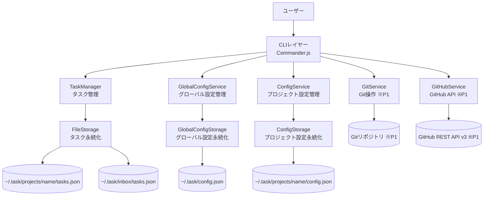
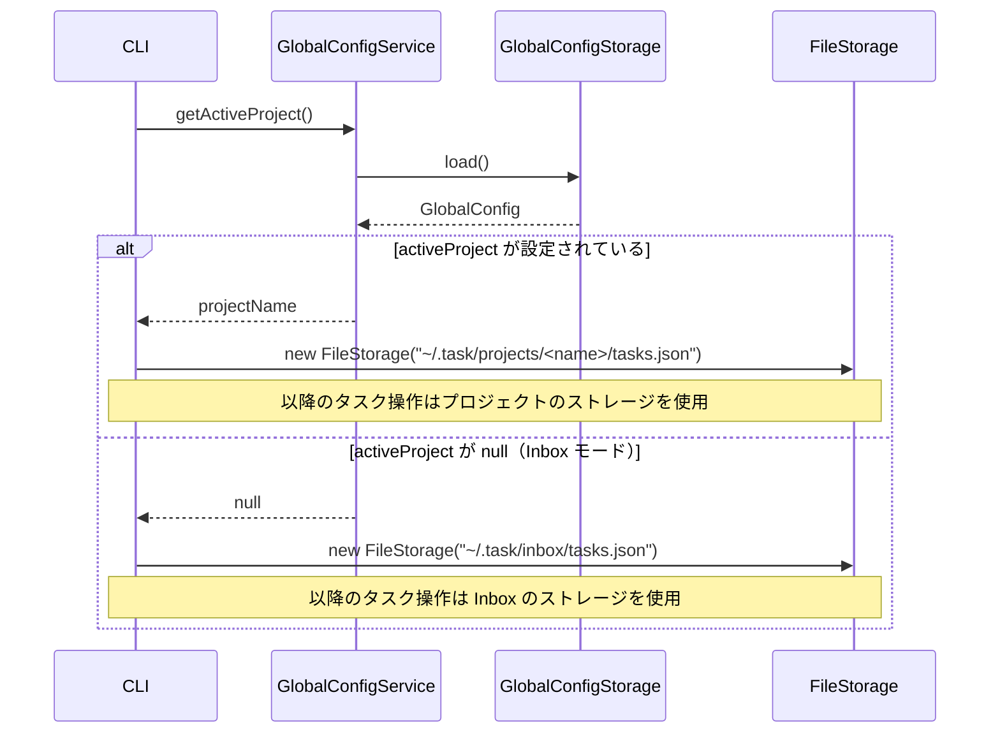
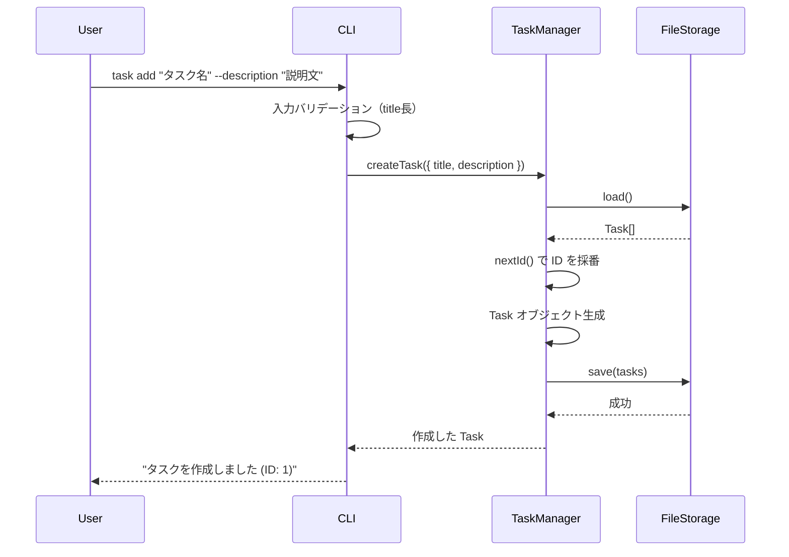
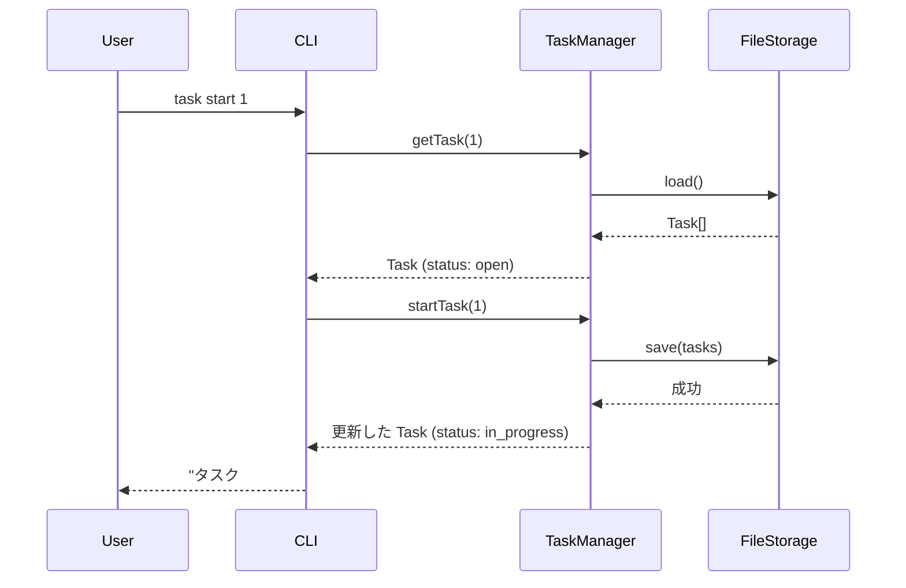
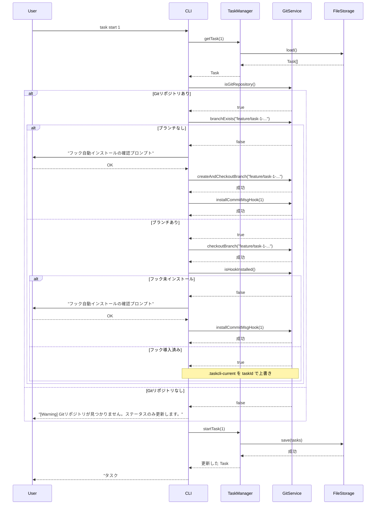
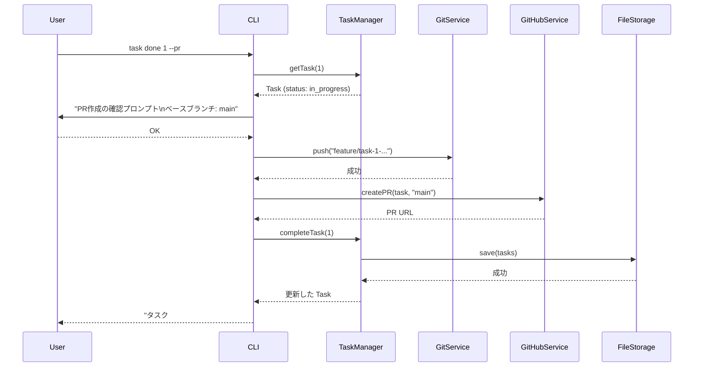
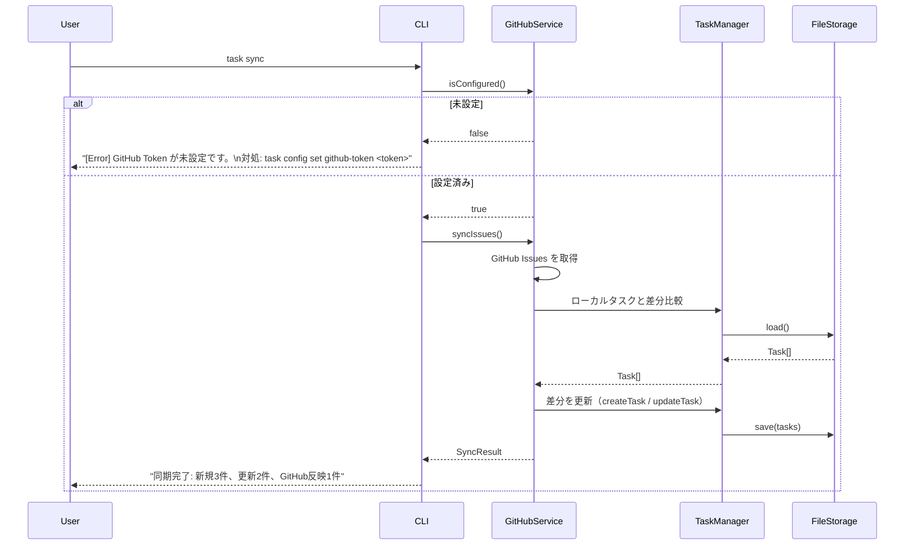
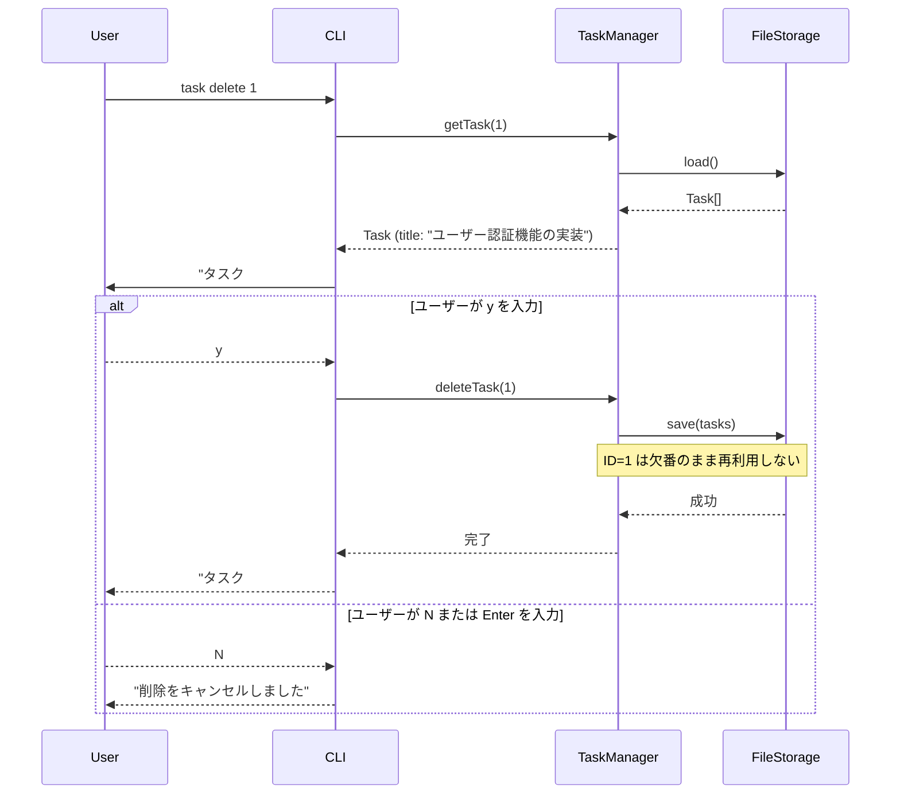

# 機能設計書 (Functional Design Document)

## 対象バージョン

| バージョン | 対象機能 |
|-----------|---------|
| v1.0 MVP（P0） | タスク基本操作・Inbox・プロジェクト管理・ステータス管理・テーブル表示 |
| v1.1（P1） | Git ブランチ自動連携・コミット自動タグ付け・絞り込み・検索・タスク編集・優先度/期限管理・GitHub Issues 連携・PR 自動作成 |
| v1.2 | 完了日時の記録・タイマーの永続化とタスク連携・作業時間の記録・`$EDITOR` 連携（GUI 導入の土台） |
| v1.3 | 書き込みのプロジェクト明示指定・YAML の排他制御とアトミック書き込み（GUI 導入の土台） |
| v1.4 | ローカル Web GUI の読み取り面（下記「ローカル Web GUI」節） |

※ P2 のうち**作業時間記録は v1.2 で実装済み**（下記「タイマー・作業時間」節）。チーム機能・テンプレート・カレンダーは本設計書の対象外。

---

## システム構成図



---

## 技術スタック

| 分類 | 技術 | 選定理由 |
|------|------|----------|
| 言語 | TypeScript 5.x | 型安全性・補完による開発効率向上 |
| CLIフレームワーク | Commander.js | 学習コストが低く、機能が十分 |
| Git操作 | simple-git | Node.jsからGit操作を抽象化するデファクトライブラリ |
| GitHub連携 | GitHub REST API v3 | PAT認証で手軽に利用可能 |
| テスト | Vitest | TypeScriptネイティブ対応、高速 |
| パッケージマネージャー | npm | プロジェクト標準 |
| ランタイム | Node.js v20以上 | v18 は EOL のため v20 LTS 以上を必須とする。開発環境は v24.11.0 を使用。 |

---

## データモデル定義

### エンティティ: Task

```typescript
type TaskStatus = 'open' | 'in_progress' | 'completed' | 'archived';
type TaskPriority = 'high' | 'medium' | 'low';

interface Task {
  id: number;              // ローカル ID（プロジェクト内で自動採番、1始まり、欠番は再利用しない）
                           // 表示時は複合 ID 形式: <projectId>-<localId>（例: 1-3）
                           // Inbox タスクは 0-<localId>（例: 0-2）
  title: string;           // タスク名（1〜200文字）
  description: string;     // 詳細説明（Markdown可、デフォルト空文字）
  status: TaskStatus;      // ステータス（デフォルト: 'open'）
  priority: TaskPriority;  // 優先度（デフォルト: 'medium'）
  branch: string | null;   // 紐付いたGitブランチ名（task start時に設定）
  dueDate: string | null;  // 期限（YYYY-MM-DD形式）
  createdAt: string;       // 作成日時（ISO 8601形式）
  updatedAt: string;       // 最終更新日時（ISO 8601形式）
}
```

**制約**:
- `id`: 正の整数。削除しても欠番のまま再利用しない
- `title`: 必須、1〜200文字
- `status`: `'open'` → `'in_progress'` → `'completed'` の一方向遷移。`'archived'` へは `'open'` または `'completed'` からのみ遷移可能（`'in_progress'` → `'archived'` は不可）
- `dueDate`: `YYYY-MM-DD` 形式。不正な日付は受け付けない

### エンティティ: GlobalConfig

グローバル設定（`~/.task/config.json`）。ユーザー全体に共通する設定を管理する。

```typescript
interface ProjectEntry {
  name: string;  // プロジェクト名
  id: number;    // 自動採番された数値 ID（Inbox は固定値 0）
}

interface GlobalConfig {
  activeProject: string | null;  // アクティブプロジェクト名（null = Inbox モード）
  projects: ProjectEntry[];      // プロジェクト一覧
  lastProjectId: number;         // 最後に採番したプロジェクト ID
}
```

**旧フォーマットとの互換性**: `projects` が `string[]` 形式の場合、`GlobalConfigStorage.load()` 実行時に自動マイグレーションを行う（`{ name, id }` 形式に変換）。変換結果は次回の書き込みコマンド実行時に `config.json` へ永続化される（遅延書き込み）。

### エンティティ: Routine

ルーティーン定義（`~/.task/daily/routines.json`）。プロジェクトに依存しないグローバルな繰り返しタスク。

```typescript
interface Routine {
  id: number;        // 自動採番（1始まり、欠番再利用なし）
  title: string;     // タイトル
  paused: boolean;   // 一時停止フラグ（true のとき list から非表示）
  createdAt: string; // ISO 8601（達成率計算の起算日として使用）
}
```

### エンティティ: DailyLog

日別の済/未済実績（`~/.task/daily/log.json`）。直近30日分を配列で保持し、古いログは自動削除。

```typescript
interface DailyLog {
  date: string;                              // "YYYY-MM-DD"（ローカルタイムゾーン）
  entries: Record<number, 'pending' | 'done'>; // routineId → 当日の状態
}
```

**自動リセット**: `task daily list` / `done` / `reset` 実行時に日付をチェックし、新しい日であれば今日の空ログを自動作成する（昨日以前のログは保持）。

### エンティティ: ProjectConfig

プロジェクト別設定（`~/.task/projects/<name>/config.json`）。※ P1 で利用する GitHub 連携設定。

```typescript
interface ProjectConfig {
  githubToken: string | null;  // GitHub Personal Access Token（P1）
  githubOwner: string | null;  // GitHubリポジトリのオーナー名（P1）
  githubRepo: string | null;   // GitHubリポジトリ名（P1）
  defaultBranch: string;       // デフォルトベースブランチ（P1、デフォルト: 'main'）
}
```

### ファイル構造

```
~/.task/
├── config.json                    # グローバル設定（activeProject 等）
├── inbox/
│   └── tasks.json                 # Inbox タスクデータ（配列）
└── projects/
    └── <name>/
        ├── tasks.json             # タスクデータ（配列）
        └── config.json            # プロジェクト別設定（GitHub Token 等、chmod 600、P1）
```

**~/.task/config.json の例**:
```json
{
  "activeProject": "my-app"
}
```

**~/.task/projects/my-app/tasks.json の例**:
```json
[
  {
    "id": 1,
    "title": "ユーザー認証機能の実装",
    "description": "JWT を使ったログイン・ログアウト機能",
    "status": "in_progress",
    "priority": "high",
    "branch": "feature/task-1-user-authentication",
    "dueDate": "2026-03-31",
    "createdAt": "2026-02-26T10:00:00Z",
    "updatedAt": "2026-02-26T11:30:00Z"
  }
]
```

**~/.task/projects/my-app/config.json の例（P1）**:
```json
{
  "githubToken": null,
  "githubOwner": null,
  "githubRepo": null,
  "defaultBranch": "main"
}
```

---

## コンポーネント設計

### CLIレイヤー (`src/cli/`)

**責務**: コマンド解析・入力バリデーション・結果の整形表示

```typescript
// src/cli/index.ts - エントリーポイント
// Commander.js でサブコマンドを登録し、各サービスに委譲する

class CLI {
  registerCommands(): void;   // 全サブコマンドを登録
  run(argv: string[]): void;  // CLI起動
}
```

**サブコマンド一覧（P0: v1.0 MVP）**:

| コマンド | 引数 / オプション | 処理概要 |
|---------|----------------|---------|
| `task add <title>` | `--description` | タスク作成 |
| `task list` | `--status <status>`, `--all-status`, `--all`, `--inbox` | タスク一覧表示。デフォルトは `open` + `in_progress` のみ表示。`--all-status` で全ステータス表示。`--all` で全プロジェクト + Inbox を一覧表示 |
| `task show <id>` | — | タスク詳細表示 |
| `task start <id>` | — | ステータスを `in_progress` に変更 |
| `task done <id>` | — | ステータスを `completed` に変更 |
| `task delete <id>` | — | タスク削除（確認プロンプト付き） |
| `task archive <id>` | — | ステータスを `archived` に変更 |
| `task project create <name>` | — | プロジェクト作成 |
| `task project list` | — | プロジェクト一覧表示（タスク数付き） |
| `task project use <name>` | — | アクティブプロジェクトを切り替え |
| `task project rename <old> <new>` | — | プロジェクト名を変更（ID は変わらない） |
| `task project remove <name>` | — | プロジェクト削除（確認プロンプト付き） |
| `task move <id> <project>` | — | タスクを別プロジェクト（または `inbox`）に移動 |
| `task inbox` | — | アクティブプロジェクトを解除し Inbox モードに切り替え |

**ルーティーン管理（P0: v1.0 追加実装）**:

| コマンド | 引数 / オプション | 処理概要 |
|---------|----------------|---------|
| `task daily add <title>` | — | ルーティーンを登録する |
| `task daily list` | `--all`（一時停止中も表示） | 今日のルーティーン一覧を表示（達成率高い順、paused は末尾） |
| `task daily done <id>` | — | ルーティーンを済にする |
| `task daily pause <id>` | — | ルーティーンを一時停止する（`list` から非表示） |
| `task daily resume <id>` | — | 一時停止を解除する |
| `task daily resume --all` | — | 一時停止中の全ルーティーンを一括で再開する |
| `task daily delete <id>` | — | ルーティーンを削除する（実績ログも削除） |
| `task daily stats` | — | 直近7日の日別達成率テーブルを表示する |
| `task daily reset` | — | 今日のチェック状態を手動リセットする（確認プロンプト付き） |

**オンボード機能（P0: v1.0 追加実装）**:

| コマンド | 引数 / オプション | 処理概要 |
|---------|----------------|---------|
| `task onboard` | — | アクティブプロジェクト・今日の毎日やること（pending）・今とりかかるべきタスク（最大3件）・全タスク一覧を一画面に表示する |

**タイマー・作業時間（P0: v1.0 でタイマー導入 / v1.2 で永続化とタスク連携）**:

| コマンド | 引数 / オプション | 処理概要 |
|---------|----------------|---------|
| `task time start [duration]` | `--task`, `--detach`, `--force` | タイマーを開始する。`duration` は `20min`/`20m`/`1h`/`30s`、または単位なし数値（分として解釈）。**省略するとストップウォッチ**。残り時間をリアルタイム表示し、終了時にターミナルベルで通知。Ctrl+C で中断した場合も経過分を記録する。`--task <id>` で作業時間の記録先を指定し、`--detach` で表示せず状態だけ記録する。実行中タイマーがあると失敗し、`--force` で置き換える（置き換えられる側は記録される） |
| `task time status` | — | 実行中タイマーの残り時間（または経過時間）を表示する。時間切れの場合は超過を表示する |
| `task time stop` | — | タイマーを終了し、経過分を対象タスクの作業時間として記録する |
| `task time cancel` | — | タイマーを破棄する（作業時間は記録しない） |
| `task time log <id> <duration>` | — | 作業時間を手動で記録する |

**タイマー状態の永続化**: 実行中タイマーは `~/.task-py/timer.yaml` に記録する。残り時間は保存された開始時刻から都度計算するため、**プロセスが落ちても・別プロセス（MCP や Web GUI）から読んでも・端末がスリープしても同じ値になる**。実行中タイマーは同時に1本のみ。

**作業時間の記録**: タスクごとの作業セッション（開始・終了・秒数）を `Task.work_sessions` として保持する。カウントダウンの場合、実績は設定時間を上限に打ち切る（タイマーの掛けっぱなしを作業時間として記録しないため）。作業時間の追記では `updated_at` を更新しない。

**タスクのライフサイクルとの連携**: `done` / `archive` は対象タスクのタイマーを記録して停止し、`delete` は記録先ごと消えるため記録せずに停止する。`move` はタイマーの向き先を移動後のタスクへ付け替える。

**完了日時（v1.2）**:

`Task.completed_at` に完了時刻を記録する。`updated_at` は編集のたびに更新されるため完了日の根拠にできないことへの対処である。アーカイブは「片付け」であって「完了の取り消し」ではないため、`completed → archived` では完了日時を保持する。移行前の完了済みタスクは値を持たないが、`updated_at` からの推測で埋めない（誤った日時を永続化すると後から真偽を区別できないため）。表示では「記録なし」とする。

**`$EDITOR` 連携（v1.2）**:

| コマンド | 引数 / オプション | 処理概要 |
|---------|----------------|---------|
| `task edit <id>` | （オプションなし） | 対話端末では `$EDITOR` を開き、説明を編集する。非対話端末（CI・パイプ）では従来どおりエラー終了する |
| `task edit <id> -e` | `--editor` | 他のオプションと併用してエディタを開く |

`VISUAL` → `EDITOR` の順に環境変数を見る。値は `shlex.split` されてから起動されるため、`EDITOR="code --wait"` のような引数付きの指定が使える。編集をキャンセルした場合・内容を元に戻した場合はどちらも「変更しない」として正常終了する。

**サブコマンド一覧（P1: v1.1）**:

| コマンド | 引数 / オプション | 処理概要 |
|---------|----------------|---------|
| `task add <title>` | `--priority`, `--due` | P0 に優先度・期限オプション追加 |
| `task list` | `--priority`, `--sort` | P0 の `--status` / `--inbox` に加え、優先度絞り込み・ソートを追加 |
| `task start <id>` | — | ステータス変更 + Git ブランチ作成 + コミットフックインストール |
| `task done <id>` | `--pr` | ステータス変更（`--pr` で PR 作成） |
| `task edit <id>` | — | タスク属性の編集（v1.2 でオプションなし実行時に `$EDITOR` を起動するよう拡張。上記「`$EDITOR` 連携」節を参照） |
| `task search <keyword>` | — | タイトル・説明の全文検索 |
| `task config setup` | — | 対話式ウィザードで GitHub Token・Owner・Repo を一括設定 |
| `task config set <key> <value>` | — | プロジェクト別設定値を個別保存（GitHub Token 等） |
| `task sync` | — | GitHub Issues と双方向同期 |
| `task import --github` | — | GitHub Issues からインポート |

---

### TaskManager (`src/services/TaskManager.ts`)

**責務**: タスクのCRUDおよびステータス管理

```typescript
class TaskManager {
  createTask(data: CreateTaskInput): Task;
  listTasks(filter?: TaskFilter): Task[];
  getTask(id: number): Task;
  updateTask(id: number, data: Partial<Task>): Task;
  deleteTask(id: number): void;
  startTask(id: number): Task;      // open/in_progress → in_progress
  completeTask(id: number): Task;   // in_progress → completed
  archiveTask(id: number): Task;    // open/completed → archived
  // title・description を対象に、大文字小文字を区別しない部分一致検索
  // 例: searchTasks("auth") → "auth"/"Auth"/"AUTH" を含む Task[] を返す
  searchTasks(keyword: string): Task[];
  nextId(): number;                 // 現在の最大IDに+1した値を返す
}

interface CreateTaskInput {
  title: string;
  description?: string;
  priority?: TaskPriority;
  dueDate?: string;
}

interface TaskFilter {
  status?: TaskStatus | TaskStatus[];  // 複数ステータス指定可（例: ['open', 'in_progress']）
  priority?: TaskPriority;
  sort?: 'id' | 'priority' | 'dueDate' | 'createdAt';
  // デフォルトは 'id' の昇順。'priority' はhigh > medium > lowの順。
  // 'dueDate' はnullを末尾に表示。
}
```

**依存関係**: `FileStorage`

---

### GitService (`src/services/GitService.ts`)

**責務**: Gitブランチ操作・コミットフック管理

```typescript
class GitService {
  isGitRepository(): Promise<boolean>;
  getCurrentBranch(): Promise<string>;
  createAndCheckoutBranch(branchName: string): Promise<void>;
  checkoutBranch(branchName: string): Promise<void>;
  branchExists(branchName: string): Promise<boolean>;
  installCommitMsgHook(taskId: number): Promise<void>;  // prepare-commit-msg フックをインストール
  push(branch: string): Promise<void>;
  formatBranchName(taskId: number, title: string): string;
  // 例: formatBranchName(1, "ユーザー認証機能の実装") → "feature/task-1-user-authentication"
  // 内部実装: src/utils/slug.ts の slugify() を使用
}
```

**依存関係**: `simple-git`

**ブランチ命名規則**:
- フォーマット: `feature/task-<id>-<slug>`
- スラッグ変換: タイトルを小文字英数字+ハイフンに変換。非 ASCII 文字（日本語等）は除去。連続するハイフンは 1 つに圧縮。先頭・末尾のハイフンも除去。
- 最大長: 63文字（超過時は切り詰め）
- スラッグが空になる場合（タイトルが全角文字のみ等）は `task-<id>` のみとする

**スラッグ変換例**:

| 入力タイトル | 変換後スラッグ |
|-----------|-------------|
| `"ユーザー認証機能の実装"` | `""` → ブランチ名: `feature/task-1` |
| `"Fix: Login Bug #123"` | `"fix-login-bug-123"` |
| `"Add OAuth 2.0 Support"` | `"add-oauth-2-0-support"` |
| `"user authentication"` | `"user-authentication"` |

**コミットフック仕様** (`.git/hooks/prepare-commit-msg`)（P1）:
```bash
#!/bin/sh
# TaskCLI: auto-append task number
TASK_ID=$(cat "$(git rev-parse --show-toplevel)/.taskcli-current" 2>/dev/null)
if [ -n "$TASK_ID" ]; then
  echo "" >> "$1"
  echo "[Task #$TASK_ID]" >> "$1"
fi
```
- `task start <id>` 実行時に Git リポジトリルートの `.taskcli-current` にタスクIDを保存（P1）
- `task done <id>` 実行時に `.taskcli-current` を削除（P1）
- `.taskcli-current` は `.gitignore` に追加する（P1）

---

### GitHubService (`src/services/GitHubService.ts`)

**責務**: GitHub Issues の同期・PR作成

```typescript
class GitHubService {
  createPR(task: Task, baseBranch: string): Promise<string>;  // PR URL を返す
  syncIssues(): Promise<SyncResult>;
  importIssues(): Promise<Task[]>;
  isConfigured(): boolean;
}

interface SyncResult {
  created: number;   // ローカルに新規作成したタスク数
  updated: number;   // 更新したタスク数
  pushed: number;    // GitHub Issues に反映したタスク数
}
```

**PR 本文テンプレート**:
```markdown
## 概要
{task.description が空でなければ記載。空の場合は「{task.title} の実装」}

## 関連タスク
Task #{task.id}
```

**依存関係**: `ConfigService`, `node-fetch` または Node.js 標準 `fetch`

---

### GlobalConfigService (`src/services/GlobalConfigService.ts`)

**責務**: グローバル設定（`~/.task/config.json`）の読み書き・アクティブプロジェクト管理

```typescript
class GlobalConfigService {
  getActiveProject(): string | null;         // アクティブプロジェクト名。null = Inbox モード
  setActiveProject(name: string | null): void;  // null を渡すと Inbox モードに切り替え
  getAll(): GlobalConfig;
}
```

**依存関係**: `GlobalConfigStorage`

---

### ConfigService (`src/services/ConfigService.ts`)

**責務**: プロジェクト別設定（`~/.task/projects/<name>/config.json`）の読み書き・バリデーション（P1）

```typescript
class ConfigService {
  get<K extends keyof ProjectConfig>(key: K): ProjectConfig[K];
  set<K extends keyof ProjectConfig>(key: K, value: ProjectConfig[K]): void;  // バリデーション後に保存
  getAll(): ProjectConfig;
}
```

**バリデーション仕様**（P1）:

| キー | バリデーション |
|-----|-------------|
| `githubToken` | `ghp_` または `github_pat_` で始まる文字列。形式が不正な場合は警告を表示して保存（APIエラーはsync/PR作成時に検出） |
| `githubOwner` | 英数字・ハイフンのみ（GitHub ユーザー名規則）。空文字は不可 |
| `githubRepo` | 英数字・ハイフン・アンダースコア・ドットのみ。空文字は不可 |
| `defaultBranch` | 空文字は不可。デフォルト値: `'main'` |

**依存関係**: `ConfigStorage`

---

### GlobalConfigStorage (`src/storage/GlobalConfigStorage.ts`)

**責務**: `~/.task/config.json` の読み書き

```typescript
class GlobalConfigStorage {
  load(): GlobalConfig;
  save(config: GlobalConfig): void;
  ensureDirectory(): void;  // ~/.task/ ディレクトリを作成
}
```

**デフォルト値**: `activeProject: null`（初回起動時は Inbox モード）

---

### FileStorage (`src/task_cli/storage/file_storage.py`)

**責務**: タスクデータ（`~/.task-py/projects/<name>/tasks.yaml` または `~/.task-py/inbox/tasks.yaml`）の読み書き・バックアップ・排他

ストレージパスはコンストラクタで受け取り、`TaskCrudUseCase` が解決した対象プロジェクトに基づいて渡す。

```python
class FileStorage:
    def __init__(self, file_path: str | Path) -> None: ...
    @property
    def path(self) -> Path: ...
    def transaction(self) -> Iterator[None]: ...  # load→変更→save を覆う排他区間
    def load(self) -> list[Task]: ...
    def save(self, tasks: list[Task]) -> None: ...
    def ensure_directory(self) -> None: ...
```

**書き込みフロー**:
1. 排他区間を取る（`tasks.yaml.lock` への `flock`）
2. 現在の `tasks.yaml` を `tasks.yaml.bak` にコピー
3. 同じディレクトリの一時ファイルへ書き、`fsync` してから `os.replace()` で差し替える
4. 親ディレクトリを `fsync` して差し替えを永続化する
5. 成功したら `.bak` を削除

読み手が観測するのは常に完全なファイルであり、書き込みが途中で失敗しても本体は変更されない。詳細は `docs/architecture.md` の「書き込み戦略」「排他制御」を参照。

---

### ConfigStorage (`src/storage/ConfigStorage.ts`)

**責務**: `~/.task/projects/<name>/config.json` の読み書き（P1）

```typescript
class ConfigStorage {
  constructor(filePath: string) {}  // 例: "~/.task/projects/my-app/config.json"
  load(): ProjectConfig;
  save(config: ProjectConfig): void;  // ファイルパーミッションを 600 に設定
}
```

---

### Renderer (`src/cli/Renderer.ts`)

**責務**: タスク一覧・詳細のターミナル表示

```typescript
class Renderer {
  renderTable(tasks: Task[]): void;
  renderDetail(task: Task): void;
  renderSuccess(message: string): void;
  renderError(error: AppError): void;
}
```

---

## ユースケース図

### UC-0: アクティブプロジェクト解決フロー

すべてのコマンド実行前に共通で走るフロー。タスクの保存先（プロジェクトまたは Inbox）を決定する。



**ヘッダー表示ルール**（`task list` 実行時）:
- アクティブプロジェクトあり → `[Project: <name>]`
- Inbox モード → `[Inbox]`

---

### UC-1: task add（タスク作成）



---

### UC-2: task start（タスク開始）

#### P0: ステータス変更のみ（v1.0 MVP）



**Inbox モードでの動作**: Inbox のタスクに `task start` を実行した場合、ステータスは `in_progress` に更新するが、「プロジェクトに移動してから Git 連携を使用してください（P1）」という情報メッセージを合わせて表示する。

#### P1: Git ブランチ作成 + コミットフックインストール（v1.1）



---

### UC-3: task done --pr（タスク完了 + PR作成）



---

### UC-4: task sync（GitHub Issues 同期）



---

### UC-5: task delete（タスク削除）



---

## UI設計（ターミナル表示）

### task list のテーブル表示

**P0（v1.0 MVP）表示**（`task list`、デフォルトは `open` + `in_progress` のみ）:
```
[Project: my-app]
 ID   Status       Title
 ──── ──────────── ────────────────────────────────────────
 1-1  in_progress  ユーザー認証機能の実装
 1-2  open         データエクスポート機能

[Inbox]  ← アクティブプロジェクト未設定時
 ID   Status       Title
 ──── ──────────── ────────────────────────────────────────
 0-1  open         買い物リスト作成
```

**`task list --all`（全プロジェクト表示）**:
```
[Project: my-app]    ← アクティブプロジェクトは緑色強調
 ID   Status       Title
 ──── ──────────── ────────────────────────────────────────
 1-1  in_progress  ユーザー認証機能の実装
 1-2  open         データエクスポート機能

[Project: personal]
 ID   Status       Title
 ──── ──────────── ────────────────────────────────────────
 2-1  open         読書リスト

[Inbox]
 ID   Status       Title
 ──── ──────────── ────────────────────────────────────────
 0-1  open         買い物リスト作成
```

**P1（v1.1）追加列**:
```
[Project: my-app]
 ID  Status       Priority  Title                            Branch                              Due
 ─── ──────────── ──────── ──────────────────────────────── ─────────────────────────────────── ──────────
  1  in_progress  high      ユーザー認証機能の実装            feature/task-1-user-authentication  2026-03-31
  2  open         medium    データエクスポート機能             -                                   -
  3  completed    low       初期セットアップ                   feature/task-3-initial-setup        -
```

**表示項目**:
| 列 | バージョン | 説明 | フォーマット |
|---|---|---|---|
| ヘッダー行 | P0 | `[Project: <name>]` または `[Inbox]` | テーブル上部に常時表示 |
| ID | P0 | タスクID | 右寄せ数値 |
| Status | P0 | ステータス | カラーコード付き文字列 |
| Title | P0 | タスク名 | 最大40文字（超過は`…`で省略） |
| Priority | P1 | 優先度 | カラーコード付き文字列 |
| Branch | P1 | ブランチ名 | 最大35文字（超過は`…`で省略）、なければ `-` |
| Due | P1 | 期限 | `YYYY-MM-DD`、なければ `-`、期限切れは赤 |

### task project list の表示

```
* my-app     5 tasks (2 in_progress)    ← * はアクティブプロジェクト
  personal   3 tasks (0 in_progress)
─────────────────────────────────────
  [Inbox]    1 task
```

- アクティブプロジェクトは `*` で強調表示
- 各プロジェクトのタスク総数と `in_progress` 件数を表示
- Inbox のタスク数をフッターに表示

---

### カラーコーディング

**ステータスの色分け**:
- `open`: 白
- `in_progress`: 黄
- `completed`: 緑
- `archived`: グレー

**優先度の色分け（task show での表示）**:
- `high`: 赤
- `medium`: 黄
- `low`: 青

**期限の色分け**:
- 期限切れ（今日以前）: 赤
- 残り 3 日以内: 黄
- それ以外: デフォルト色

---

## ローカル Web GUI（v1.4・読み取り面）

`task-py web` で起動する3つ目の入口。CLI（端末）・MCP サーバー（stdio）と同じ
`~/.task-py/` を読む。**この段階では読み取りだけを行う。**

### 起動

```
task-py web [--port 8765] [--no-open]
```

- **127.0.0.1 にのみ待ち受ける**。`--host` は用意しない（認証も CSRF 対策も持たない面を
  ネットワークへ出せてしまうため）
- 既定でブラウザを開く。`--no-open` で抑止する
- ポートが埋まっている場合は、トレースバックではなく原因と対処を示して終了する

### 画面

| 画面 | 内容 | 対応する CLI |
|---|---|---|
| 要約 | 実行中のタイマー・今日のルーティーン・未着手のタスク | `overview` |
| すべて | 全プロジェクトと Inbox のタスクをまとめて表示。ステータス／優先度／並びで絞り込む | `list --all` |
| プロジェクト別 / Inbox | 単一の保存先のタスク | `list` / `list --inbox` |
| 詳細 | 説明・期限・解禁日・完了日時・合計作業時間・作業セッション | `show` |
| 検索 | 全プロジェクト横断 | `search`（横断に拡張） |

編集は行わない。画面には「読み取り専用（編集は task-py コマンドから）」と表示する。

### JSON API（すべて `GET`）

| エンドポイント | 内容 |
|---|---|
| `/api/state` | アクティブプロジェクト・プロジェクト一覧・リビジョン |
| `/api/overview` | 要約画面の材料 |
| `/api/tasks` | 全プロジェクト横断（`inbox` と `projects` に分けて返す） |
| `/api/inbox/tasks` / `/api/projects/{name}/tasks` | 保存先ごとの一覧 |
| `/api/inbox/tasks/{id}` / `/api/projects/{name}/tasks/{id}` | 詳細 |
| `/api/search?q=` | 全プロジェクト横断の検索 |
| `/api/events` | Server-Sent Events。他プロセスの変更を通知する |

**Inbox と名前付きプロジェクトはパスで分ける。** クエリ1つで表すと `None`（Inbox）と
「未指定」を URL 上で区別できず、`project=inbox` のような予約語方式では
`inbox` という名前のプロジェクトが作れなくなる。パスを分ければ
`/api/projects/inbox/tasks` と `/api/inbox/tasks` が別物として共存する。

エラーは CLI と同じ文面を返す: `{"error": {"message", "cause", "remedy"}}`。
「見つからない」は 404、クエリの不正は 400。

### 他プロセスの変更の反映

`~/.task-py/` 配下の監視対象ファイル（`config.yaml` / 各 `tasks.yaml` / `timer.yaml` /
`daily/*.yaml`）の mtime とサイズからリビジョン値を作り、変わったら SSE で通知する。
**差分は送らない**。クライアントは通知を受けて表示中のものを取り直す。

サーバーは**1秒間隔**でリビジョンを再計算し、前回と違った回だけ送る。したがって
他プロセスの変更は最大で1秒程度の遅れで画面に届く。接続直後にも現在の値を1度送る
（`EventSource` は切断時に自動再接続するため、その間の変更を取りこぼさない）。

### 画面の実装方針

- React と htm の UMD ビルドを**リポジトリに同梱**し、実行時に CDN を読まない。
  オフラインでも壊れず、起動のたびに外部へ通信することもない
- **ビルド工程を持たない**。node / npm を使わず、JSX の代わりに htm の
  タグ付きテンプレートリテラルを使う
- 静的ファイルは `Cache-Control: no-cache` で配信する。付けないと、利用者が
  task-py を更新してもブラウザが古い JavaScript を実行し続ける

---

## エラーハンドリング

### エラークラス設計

```typescript
class AppError extends Error {
  constructor(
    message: string,
    public readonly cause: string,
    public readonly remedy: string
  ) {
    super(message);
  }
}
```

### エラー表示フォーマット

```
[Error] <エラーの概要>
  原因: <なぜ失敗したか>
  対処: <ユーザーが取るべき操作>
```

### エラー種別一覧

| エラー種別 | 処理 | 表示例 |
|-----------|------|-------|
| 入力バリデーション | 処理を中断 | `[Error] タイトルが長すぎます。\n  原因: 201文字以上の入力は受け付けません。\n  対処: 200文字以内で入力してください。` |
| タスクが見つからない | 処理を中断 | `[Error] タスクが見つかりません。\n  原因: ID=99 のタスクは存在しません。\n  対処: task list で有効なIDを確認してください。` |
| 不正なステータス遷移 | 処理を中断 | `[Error] このタスクは開始できません。\n  原因: archived のタスクは変更できません。\n  対処: 新しいタスクを作成してください。` |
| Gitリポジトリなし | ブランチ操作をスキップ、警告表示 | `[Warning] Gitリポジトリが見つかりません。ステータスのみ更新します。` |
| Gitブランチ操作失敗 | 元のブランチに戻す、処理を中断 | `[Error] ブランチの作成に失敗しました。\n  原因: <git エラーメッセージ>\n  対処: git status を確認し、未コミットの変更を解消してください。` |
| GitHub Token 未設定 | 処理を中断 | `[Error] GitHub Token が未設定です。\n  原因: GitHub 連携機能には設定が必要です。\n  対処: task config set github-token <token> で設定してください。` |
| GitHub API エラー | 処理を中断 | `[Error] GitHub API リクエストが失敗しました。\n  原因: <HTTPステータスコード> <メッセージ>\n  対処: Token の権限と有効期限を確認してください。` |
| ネットワークタイムアウト | 処理を中断 | `[Error] ネットワークタイムアウト（5秒）が発生しました。\n  原因: GitHub API に接続できません。\n  対処: インターネット接続を確認してください。` |
| Inbox タスクへの `task start`（P1 機能の案内） | ステータスのみ更新、情報メッセージ表示 | `[Info] タスク #1 を開始しました。Git 連携（P1）を使用する場合は task move 1 <project> でプロジェクトに移動してください。` |
| ファイル読み込み失敗 | 空データで初期化し継続 | `[Warning] タスクデータが見つかりません。新規作成します。` |
| ファイル書き込み失敗 | 一時ファイルを破棄し本体は無変更のまま処理中断（`.bak` からの復元経路も残す） | `[Error] タスクデータの保存に失敗しました。\n  原因: ディスクの空き容量が不足している可能性があります。\n  対処: ディスク容量を確認してください。` |

---

## パフォーマンス設計

- **JSONファイルの全件読み込み**: 1 コマンド実行あたり 1 回のみ `load()` を呼ぶ。複数回 I/O しない
- **検索**: `Array.prototype.filter` + 文字列 `includes` で十分（最大 10,000 件でも数ミリ秒以内）
- **タイムアウト**: GitHub API 呼び出しには `AbortController` で 5 秒のタイムアウトを設定
- **バックアップ**: `tasks.yaml` の書き込み時のみ `.bak` を作成し、完了後即削除。常時 2 ファイル以上保持しない
- **排他とfsync**: 単一ストレージを操作するコマンドではロック取得1回・`fsync` 2回（本体と親ディレクトリ）。`move` と `time stop` は複数ファイルに跨るため複数回になる。実測で従来比 +0.35ms（中央値 7.18ms → 7.53ms）であり、ローカル操作 100ms 以内の要件に影響しない

---

## セキュリティ設計

- **`~/.task/` のパーミッション**: `GlobalConfigStorage.ensureDirectory()` 実行時に `fs.chmodSync("~/.task/", 0o700)` を設定し、オーナーのみアクセス可能にする
- **プロジェクト設定ファイルのパーミッション（P1）**: `ConfigStorage.save()` 後に `fs.chmodSync(path, 0o600)` を実行し、オーナーのみ読み書き可能にする（`~/.task/projects/<name>/config.json` に GitHub Token を格納するため）
- **`.taskcli-current` の `.gitignore` 追加（P1）**: `task start` 実行時に Git リポジトリルートの `.gitignore` に `.taskcli-current` を追記するか確認プロンプトを表示する
- **コマンドインジェクション防止（P1）**: `simple-git` の API を使用し、シェルコマンドの文字列結合を行わない。GitHub API リクエストのパラメータは `encodeURIComponent` でエスケープする

---

## テスト戦略

### ユニットテスト（`src/**/*.test.ts`）

- `TaskManager`: 各メソッドの正常系・異常系（ステータス遷移違反、ID不存在など）
- `GitService`: `formatBranchName` のスラッグ変換ロジック
- `FileStorage`: バックアップ・リストアのロジック（モックファイルシステム使用）
- `Renderer`: 期限切れ・長タイトルのトリミングなど表示ロジック

### 統合テスト

- `task add` → `task start` → `task done` の一連のフロー（実際のファイル I/O を使用）
- `FileStorage` のバックアップ復元（書き込み途中でのクラッシュをシミュレート）

### E2Eテスト（手動）

- Gitリポジトリありの環境で `task start` → ブランチ自動作成を確認
- Gitリポジトリなしの環境で `task start` → 警告表示のみでクラッシュしないことを確認
- `task done --pr` での PR 作成（テスト用 GitHub リポジトリを使用）
